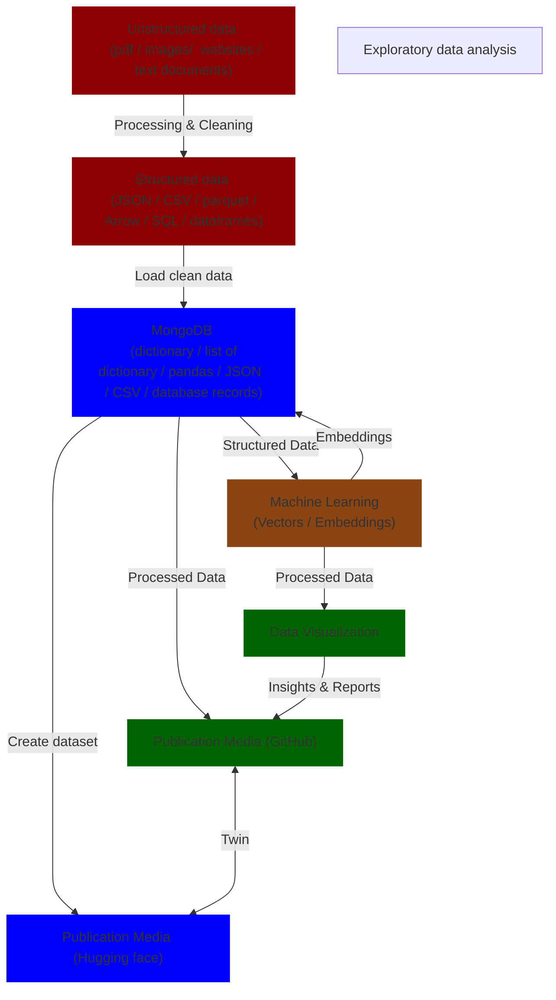
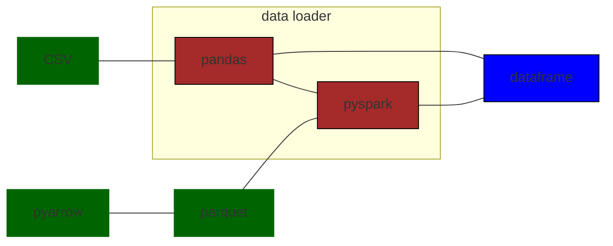

Updated: Outline of the course

### Course: Programming for humanist
### Brief breakdown of the course

- Introduction (week 1, 0% in the group project)
- Accessing, handling and transformation of data (25% of the content)
- Populating and managing data with some database schemas (25% of the content)
- Machine learning (25% of the content)
- Analysis and visualization from data (25% of the content)

---

### Possible digital humanities projects that students can work on:

|            | Digitizing Historical Artifacts | Literature Text Analysis | Art History Image Classification | Cultural Heritage Text Translation |
|------------|---------------------------------|-------------------------|---------------------------------|------------------------------------|
| Part 1     | Collect historical documents, digitize them using OCR tools, and organize them in digital formats. | Scrape literary texts from public domain sources, clean and preprocess the text data. | Collect a dataset of art images from various time periods and artists. | Collect multilingual historical texts related to cultural heritage. |
| Part 2     | Create a NoSQL database to store the digitized artifacts, including metadata like date, artist, and location. | Create a NoSQL database to store the literary texts and their metadata, allowing for efficient retrieval and analysis. | Create a NoSQL database to store art images and associated metadata, such as artist, style, and location. | Create a NoSQL database to store multilingual texts and their translations. |
| Part 3     | Implement machine learning models to categorize and tag images of the artifacts based on their style and content. | Apply sentiment analysis and topic modeling to the literature texts to uncover themes and sentiments within different works. | Implement image classification using neural networks to categorize art pieces by style and artist. | Utilize transformer models (e.g., Hugging Face) to perform automated translation of historical texts between languages. |
| Part 4     | Develop interactive visualizations showcasing the historical artifacts' evolution over time and artists' styles. | Develop a web application using Streamlit to visualize the evolution of literary themes and sentiment over time. | Develop a machine learning dashboard using Streamlit to allow users to explore and classify art images interactively. | Develop a tool to visualize and compare translations, allowing users to explore the cultural context of the texts. |

This table format provides a clear overview of the different projects and their respective project parts.

- Overall framework for this course: 


- The relationship between these files



---

# A more detailed syllabus

- Introduction (week 1)
	- Overview of the course, Breaking down some example digital humanities projects 
	- Creation of Github package


	- Writing and reading object-oriented programming with python
		- Purpose: student can get familiar with the style of programming that hiding detail
		- Briefly discuss some principles of writing effective code, such as modularity, information hiding. 

	 - Self-learning package:
		- Overview of the tools will be used throughout the course (vs code, database, Github, huggingface)
		- Discovering available solutions from github
		- Getting free github copilot with CUHK email

## Reference
- Pair programming with github copilot
	- Register github student package and installing it
	- Should be included in the self-learning pack
- Pair programming inside google colab:
	- https://blog.google/technology/developers/google-colab-ai-coding-features/
- Revision of python basics:
	- Video 3 to 6
	- https://www.youtube.com/watch?v=BBSZWHNXUGE&list=PLBtyBPTlyC7tnpPDkp_E2JgIgIQSbugJL&index=3
- Github
	- Create a github student account
	- Learn "explore GitHub" and complete action: https://education.github.com/experiences/primer_explore_github
	- Learn "Profile README" and complete action: https://education.github.com/experiences/launchpad_profile_readme
	- Student events:
		- Hactoberfest: 
			- Hacktoberfest is an annual event that takes place every October, organized by DigitalOcean in partnership with GitHub and other companies. It encourages participation in open-source projects and promotes the open-source community.
		- Kaggle:
			- Data science competition with prize


- List of Digital humanities projects:
	- https://libguides.lib.miamioh.edu/c.php?g=957684&p=6913753
---

### Part I: Accessing, mining, handling and transformation of data

- Introduction to digital historical artifacts and cultural heritages
	- Definition and significance of historical artifacts in preserving cultural heritage.
	- Overview of different types of artifacts: 
		- manuscripts, letters
		- artworks, photographs
		- Text database (such as cuhk's ctext website)

- Sample Project Gutenberg Corpus
	- Paper: (A standardized Project Gutenberg corpus for statistical analysis of natural language and quantitative linguistics) https://arxiv.org/pdf/1812.08092v1.pdf
	- GitHub: follow the instruction of the repository to download the dataset: https://github.com/pgcorpus/gutenberg/tree/master

- Digitisation techniques
	- Manuscripts, letter images: OCR
	- Text: NLTK, regex
	- Webpage: web scraping software, such as octoparse
	- PDF to text
```python
import pdfminer
from pdfminer.high_level import extract_text

def read_pdf(file):
    text = extract_text(file.name)
    return text
```


- Accessing online resources with programming
	- Introduction of API
		- Motivation: Government API, worldbank API etc
	- Case study: Accessing Artworks: 
		- Metmuseum (https://www.metmuseum.org/art/collection/search/53222)
		- Requesting metadata, and the actual images of the artwork from Metmuseum API.

- Introduction to data format
	- JSON (while downloading the data from online resources)
	- CSV 
	- parquet
	- arrow
	- SQL
- Document ETL:
	- Langchain retrieval (document loaders, document transformers)
		- https://python.langchain.com/docs/modules/data_connection/document_transformers/
	- Hugging face retrieval (csv, json, parquet, arrow, SQL)
		- `dataset = load_dataset("arrow", data_files={'train': 'train.arrow', 'test': 'test.arrow'})`
- Data cleaning and preprocessing 
	- Dealing with missing values
	- Enforcing attribute types to columns of CSV, and check the validity of cell values. 
- Get to know the data quality standard 00
	- Art images
		- Uniform resolution? Resizing and standardizing the resolution
		- Ensure all images are in a consistant format (jpeg, png) for ease of processing
		- Folder structure 
			- (will be used in machine learning and database)
			- organization of your data will significantly impact the workflow
- Huggingface datasets
	- Project gutenberg:  https://huggingface.co/datasets/alturing/gutenberg-texts
- Apache arrow
	- Get started article: https://medium.com/@ctagard19/pandas-meets-pyarrow-a-data-scientists-dream-come-true-dff849d61db5
	- Documentation: https://arrow.apache.org/docs/python/compute.html
## References of each project

### Digital humanities data source
- Projects
	- Datacamp - Project: Word Frequency in Classic Novels(Project Gutenberg)
		- https://projects.datacamp.com/projects/38
	- Datacamp - Project: Word Frequency in Moby Dick
		- https://projects.datacamp.com/projects/1633
- Datasets 
	- ([UCI Machine Learning Respository](https://archive.ics.uci.edu/ml/index.php))
		- The University of California at Irving Machine Learning Repository is a collection of databases, domain theories, and data generators that are used by the machine learning community for the empirical analysis of machine learning algorithms.
	- [Google Public Data Explorer](https://www.google.com/publicdata/)
		- The Google Public Data Explorer makes large datasets easy to explore, visualize and communicate.
	- [Kaggle Datasets](https://www.kaggle.com/datasets)
		- Google's Kaggle platform allows users to explore, analyze, and share quality data.  
		- Types of Datasets. Kaggle supports a variety of dataset publication formats, but we strongly encourage dataset publishers to share their data in an accessible, non-proprietary format if possible.
	- Data.gov.hk (https://data.gov.hk/en/)
		- The home of the Hong Kong Government’s open data
	- [Statista](https://libguides.lib.miamioh.edu/statista)
		- Statista provides users with an innovative and intuitive tool for researching quantitative data, statistics and related information. The database integrates data on over 80,000 topics from over 18,000 sources on a single platform.
- Textual corpora
	- [Oxford Text Archive](https://ota.bodleian.ox.ac.uk/repository/xmlui/)
	- [VEP TCP Collection](http://graphics.cs.wisc.edu/WP/vep/vep-tcp-collection/)
	- [Corpus Molinero (Spanish)](http://www.molinolabs.com/corpus.html)
	- [Googlebook N-gram corpus](http://storage.googleapis.com/books/ngrams/books/datasetsv2.html)
- Digital library based tools
	- [HathiTrust Research Center](https://www.hathitrust.org/htrc)
		- The HathiTrust Research Center makes available a toolkit of services for text data mining.
	- [Constellate](http://labs.jstor.org/projects/text-mining/)
		- A text analytics platform aimed at teaching and enabling a generation of researchers to text mine. Two of ITHAKA’s services, JSTOR and Portico, are the initial sources of content for the new platform.
	- [The Intertextual Hub](https://intertextual-hub.uchicago.edu/)
		- The Intertextual Hub is an experimental digital humanities reading environment that aims to situate specific documents in their broader context of intertextual relations, whether in the form of direct or indirect borrowings, shared topics with other texts or parts of texts, or other kinds of lexical similarity.
	- Project Gutenberg
		- Project Gutenberg is a volunteer effort to digitize and archive cultural works, as well as to "encourage the creation and distribution of eBooks."
		- https://www.gutenberg.org/files/2701/2701-h/2701-h.htm
## Art history image classification / Digitizing historical artifacts 
- Dataset and packages that built upon that dataset: 
	- Wikiart: https://www.wikiart.org/en/leonardo-da-vinci/mona-lisa
	- Wikiart retriever: https://github.com/lucasdavid/wikiart
	- Wikiart classifier: https://github.com/mbellitti/wikiart-classifier
	- Wikiart GAN: https://github.com/cs-chan/ArtGAN
- API education:
	- Understanding API's documentation to learn how to access the data
	- Understand the endpoints available and the data format they provide. 
- Packages:
	- Hugging face Image captioning, OCR, and Pix2struct (visual questioning info-graphics, charts, scientific diagrams)
		- https://huggingface.co/tasks/image-to-text
		- Demo section included in that webpage. 

## Literature Text/Audio Analysis /  heritage text translation 
- Dataset: 
	- Project Gutenberg (A project that digitize classical books): https://www.gutenberg.org/
- API education:
	- Understanding project Gutenberg's API documentation to learn how to access the data. 
	- Understand the endpoints available and the data format they provide. 

### Data quality requirements
- Images
- Text / corpus
	- NLP preprocessing with NLTK
		- Teaching resource: https://realpython.com/nltk-nlp-python/

### ETL process, pandas
- Datacamp: Data Manipulation with pandas
	- https://app.datacamp.com/learn/courses/data-manipulation-with-pandas
- Datacamp: Streamlined Data Ingestion with pandas (Section 1 and 4)
	- https://app.datacamp.com/learn/courses/streamlined-data-ingestion-with-pandas
- Pandas User Guide
	- https://pandas.pydata.org/pandas-docs/stable/user_guide/io.html
- Pandas cheatsheet
	- https://pandas.pydata.org/Pandas_Cheat_Sheet.pdf

### Data cleaning 
- Cleaning data with python pandas
	- https://github.com/analyticswithadam/Python/blob/main/Pipe.ipynb
	- 
- OpenRefine
	- Resource: https://openrefine.org/
	- A free, open source, powerful tool for working with messy data.
- Alternative tools trend comparison: 


### Course-level reference
- Datacamp: Building data engineering pipelines in python
	- https://app.datacamp.com/learn/courses/building-data-engineering-pipelines-in-python
	- 

---

- Part II: Populating and managing data with some database schemas
	- Introduce the advantages of NoSQL on digital humanities projects
		- Flexibility and schema-less design
		- Ability to handle numerical metadata for data, such as location values for geo-spatial data, embedding values for data that was processed by machine learning 
	- Why MongoDB?
		- In digital humanity projects, 
		- MongoDB allowed us to save our incremental results for later processing and modeling, which collectively saved us hours of waiting for code to re-run.
	 - MongoDB basics:
		- Creation and maintenance of database
		- CRUD operations in MongoDB
	- Database integration:
		- Establishing pipelines/interface of the database so that the database can be integrated to the workflow of other groupmates .

- What to learn?
	- Document structure: 
		- Understanding how data is represented as BSON (Binary JSON) documents in MongoDB.
		- Designing appropriate document structures for storing digitized artifacts, literary texts, art images, and multilingual texts along with their metadata.
	- Collections:
		- Creating and managing collections to organize related documents.
		- Choosing suitable collection names for storing different types of data (e.g., artifacts, literary texts, art images, multilingual texts).
	- Indexes:
		- Creating indexes on fields used for querying (e.g., artist, style, date) to improve query performance.
		- Understanding the impact of indexing on read and write operations.
	- NoSQL Database Design:
		- Designing schema-less databases for literary texts, art images, and multilingual texts.
		- Embedding related information within documents (e.g., embedding metadata within literary texts or art images documents).
	- CRUD Operations:
		- Learning how to perform Create, Read, Update, and Delete operations on MongoDB documents.
		- Using methods like insertOne(), insertMany(), find(), updateOne(), and deleteOne() to manipulate data.

---
- From book "data science and machine learning python"
	- ACID principle versus BASE principle
	- Four types of NoSQL database
	- 


---

## Reference

- MongoDB and Tensorboard (a visualization framework) applying on machine learning projects:
	- Example: https://www.mongodb.com/developer/code-examples/python/song-recommendations-example-app/#data-visualizations-with-tensorflow-and-mongodb
- Training machine learning models with MongoDB:
	- https://www.mongodb.com/blog/post/training-machine-learning-models-with-mongodb#:~:text=In%20conclusion%2C%20MongoDB%20provides%20several,than%20with%20traditional%2C%20relational%20databases.
- Vector search in MongoDB
	- 
- MongoDB associate developer certification
	- https://learn.mongodb.com/learn/course/mongodb-associate-developer-exam-study-guide/main/associate-dba-exam-study-guide
	- This could be treated as the guideline for this unit of the course
- Associate developer python practice questions
	- https://learn.mongodb.com/courses/associate-developer-python-practice-questions
- MongoDB python developer path
	- https://learn.mongodb.com/learning-paths/mongodb-python-developer-path
	- This is a course that prepare the learner for the certificate exam
- Figure


---

- Part III: Machine learning 
	- Bridging the gap from database to machine learning
		- "mongoDB deep learning pdf"

	- Introduction to machine learning concepts
		- What is learning
			- Neurons
			- (Text / image /music) Encoding and decoding 
			- Gradient descent
			- Predictions 
			- Dimensionality
			- Embedding
		- How unsupervised learning works
			- Clustering
			- Dimensionality reduction
		- Nice unsupervised learning 
			- Hierarchical clustering and Dendrograms
		- Neural network types
			- RNN and LSTM for text
			- CNN for images
		- Embeddings (https://learn.deeplearning.ai/google-cloud-vertex-ai/lesson/3/understanding-text-embeddings)
			- Visualizing embeddings (https://learn.deeplearning.ai/google-cloud-vertex-ai/lesson/4/visualizing-embeddings)
	- Code exercises using popular machine learning libraries
	- Embedding as the final product of machine learning
		- Class activities:
			- Display text, images embeddings from model
			- Calculate similarity score with embedding values 
			- Evaluate models using embeddings
	- Applying machine learning to humanities data
		- Text classification, sentiment analysis
		- Text translation with `huggingface-transformer`
		- Named entity recognition with `stanza`
		- Image data:
			- Image-to-text-caption with hugging-face "image captioning" module
		- Image recognition to categorize and tag images 
		- Topic modeling
		- Text summarization
		- Style analysis
		- KNN for clustering

- Lesson 1:
	- Basic understanding of neural networks
		- Tensorflow playground
		- Teaching resource: 
			- Deep Learning: A Free Mini-Course
- Lesson 2:
	- Creating embeddings / feature vectors 
		- https://github.com/mbellitti/wikiart-classifier/blob/master/src/Create_Featurevectors.ipynb
- Lesson 3:
	- Classify and evaluate results
		- https://github.com/mbellitti/wikiart-classifier/blob/master/src/keras_classify_evaluate.ipynb
		- 

## Resource:

### Basics of machine learning 
- Resource: 
	- coursera (Andrew Ng's machine learning for everyone )
	- databookuw (https://databookuw.com/page/page-9/)
	- Pytorch (Deep learning with PyTorch - A 6 0minute biltz) https://pytorch.org/tutorials/beginner/deep_learning_60min_blitz.html
	- DeeplearningAI - Understanding and applying text embeddings (https://www.deeplearning.ai/short-courses/google-cloud-vertex-ai/)
	- First 3 weeks of deeplearning.ai course 1, Natural Language Processing with Classification and Vector Spaces, of NLP specialization (https://www.coursera.org/learn/classification-vector-spaces-in-nlp?specialization=natural-language-processing)
	- Datacamp - unsupervised learning in python
		- https://app.datacamp.com/learn/courses/unsupervised-learning-in-python
- Project: 
	- a) Datacamp - find text similarity from plot summaries
		- https://app.datacamp.com/learn/projects/648
	- b) Applying embeddings of text, to build a question answering machine to our database
		- Resource:
			- DeeplearningAI (Understanding and Applying Text Embeddings)
				- Understanding text embeddings
				- Visualizing embeddings
				- Text generation
				- Building Q&A systems using semantic search
	### Feature extraction
- Packages:
	- Microsoft's synapseML (open-source librAccess the Webpageary)
		- Gutenberg project is officially linked with synapaseML (https://marhamilresearch4.blob.core.windows.net/gutenberg-public/Website/index.html#Code). SynapseML is a modern software for analyzing literature, but it is too complicated for putting into a humanity course.
	- Hugging face 

### Model selection
- Image
	- CNN
- Text
	- RNN
	- LSTM
	- GPT


---

- Part IV: Analysis from data
	- Exploratory data analysis:
		- Retrieving data from MongoDB and perform exploratory data analysis for uncovering patterns and insights.
	- Visualization
		- Scikit-plot:
			- creating machine learning plots, such as confusion matrices, ROC curves 
		- Streamlit:
			- Create web applications with interactive visualizations, machine learning dashboard
		- Gradio:
			- Create machine learning demo. Easy to code. 
			- Example:
				- https://huggingface.co/spaces/sblumenf/PDF-text-extractor/blob/main/app.py
				- https://huggingface.co/spaces/sblumenf/PDF-text-extractor
	- Communicating research findings through compelling visual narratives.
	- Final project presentations: Students demonstrate their skills by presenting their group projects, incorporating MongoDB data, machine learning insights, and effective data visualizations.

## Reference

### Deployment
- Tensorflow embedding projector (online tool to play with):
	- https://projector.tensorflow.org/
- Tensorboard
	- Images during training (for )
	- Audio (for speech recognition)
	- Textual summaries (model summaries, explanations)
	- Profile data
	- Computational graphs of your tensorflow model
- Would PyTorch support these functionalities?
	- Yes. `torch.utils.tensorboard` allow PyTorch user to use Tensorboard to visualize PyTorch models and training processes. 
		- Install tensorboardX: `pip install tensorboardX`
		- Import and Use TensorBoardX: `from torch.utils.tensorboard import SummaryWriter`
		- Run tensor-board: `tensorboard --logdir=path/to/logs`
- 
- Publication:
	- 1. Export TensorBoard Logs
	- 2. Configure TensorBoard for External Access:
	- 3. Embed TensorBoard in a Webpage
	- 4. Host the Webpage
	- 5. Access the Webpage

---


---
- reference book:
	- [Book review - Introducing data science](../Book%20review%20-%20Introducing%20data%20science.md)


---

### A more detailed syllabus (Old)

- Course: Programming for humanists
	- Introduction (Lecture 1) 
	- Overview of the course
	- Writing and reading object-oriented programming (get familiar with the style of programming that hiding details)
		- Writing and reading object-oriented programming
			- Purpose: (get familiar with the style of programming that hiding details)
		- Data
			- Types of data
				- Unstructured data
					- Images
					- Articles
				- Structured Data
					- Geo-spatial data
					- Time series data
			- Source of data
				- Online databases
				- Digital archives with curated historical documents
		- Introducing components of a digital humanity project
			- "Front-end / presentations" components (most of the content in the course 1, HIST4702)
				- Websites
				- Charting, visualization
			- "Back-end / analytics"  components (The focus of this subject)
				- NoSQL Database
				- Programming scripts 
				- Machine learning tools 
					- Embeddings
					- Transformers
		- Installations and registrations of accounts
			- Github:
				- Register Github student developer pack and getting free github copilot
			- Huggingface
		- Toolkit discovery as a programmer
			- Ways of using github, huggingface, stackshare to explore suitable tools for the digital humanity project

	- Programming as a "Back-end" knowledge of a digital humanity (DH) projects 
		- 1. Getting / accessing / populating data (Should be remove old technology pipelines)
			- Introduce:
				- script packages such as beautiful-soup, selenium
				- knowing how to work with external data, such as HTML, XML, JSON
				- pre-built scraping software such as octoparse
			- REST API of websites, such as twitter
			- Understanding principles of organizing a corpus / unified dataset
			- Understanding structure of database

		- 2. Managing data with MongoDB 
			- Read: Data querying and searching
			- Write: Host and curate collections of historical documents
				- NoSQL database (mongoDB)
				- (digital archives and repositories)
			- Clean: Data cleaning packages 
			- Discuss effective task separation before start working the programming. Github copilot prompting and Coding regarding to mongoDB

		- 3. Data parsing and transformation (preprocessing, labelling)
			- Creating labels
				- NLP preprocessing with spaCy etc
				- Named-entity recognition 
			- Machine translation

		- 4. Analysis from data
			- Existing embeddings
				- OpenAI embeddings
				- Open-source embeddings from hugging-face
				- HistWords: word embeddings for historical text
					- https://nlp.stanford.edu/projects/histwords/
					- It is an open-sourced package
			- Fundamental tasks
				- Topic modeling (introducing clustering, LDA)
				- Text analysis (with established packages such as BookNLP)
				- Sentiment analysis
				- KNN for clustering 
			- Application level tasks:
				- https://huggingface.co/tasks

		- 5. (Self-teaching / part of assignment) Publishing scripts, data into the internet
			- Github, huggingface
				- Documentation, version control skills with github functionalties
				- Knowing the specifications and demands from "front-end" part of DH projects
			- Other website that hosting digital humanities data