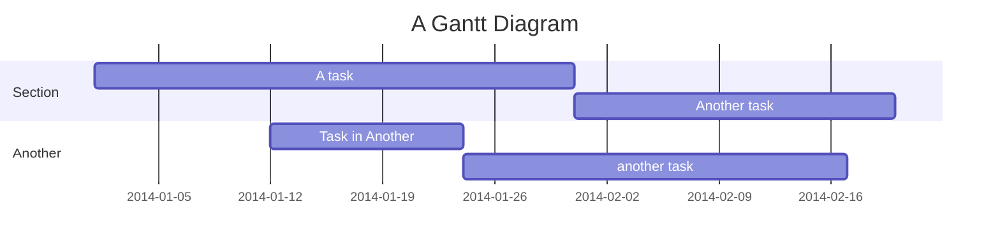

- Breakdown of 9-months
	- Project kick-off and research (Month 1-2)
		- define and document the [[desired qualities the making good output of this job position]]
		- discuss, define and document the [[course objectives and learning outcomes]]
		- begin preliminary research on the intersection of programming and humanities. 
			- [[Research reading sprints]]
		- Identify key concepts and resources.
			- Research similar courses and teaching materials for inspiration.
		- Identify the [[pedagogy#^7d354f|Target audience and their skill levels]].
		- Create a detailed project plan, including tasks, milestones, and deadlines.
			- Define the [[pipeline]] completing each sub-task effectively
	- Curriculum development (Month 3-4)
		- Begin drafting the syllabus
		- Develop the [[course structure]] and lesson plans.
			- Create a detailed outline of the course structure, including topics, modules, and learning objectives.
		- Create or gather [[teaching materials]] (slides, handouts, exercises).
		- Develop course materials, including lecture notes, assignments, and reading lists.
			- Begin developing course assignments and assessments.
			- Define the [[style and tone for the course materials]], and enforce them on the [[teaching materials]]
	- Course Testing and Revision
		- Pilot test the [[teaching materials]] with a small group of students or colleagues for feedback.
		- Analyze feedback and make necessary revisions to improve the course.
		- Finalize the [[course structure]]and [[teaching materials]].
	- Administrative Tasks and Documentation
		- Prepare administrative documents, including grading rubrics, course policies, and evaluation methods.
		- Develop a course website or online platform for resources and communication.
		- Create a detailed instructor's guide for yourself and any future instructors.
	- Final preparations and launch
		- Conduct a final review of all course materials and make any last-minute adjustments.
		- Hold a faculty or department meeting to introduce the course to potential instructors and students.
		- Prepare for your part-time master's program by organizing your schedule and resources to ensure a smooth transition into your studies.

